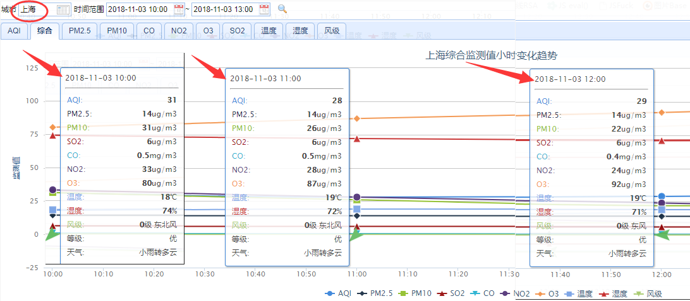
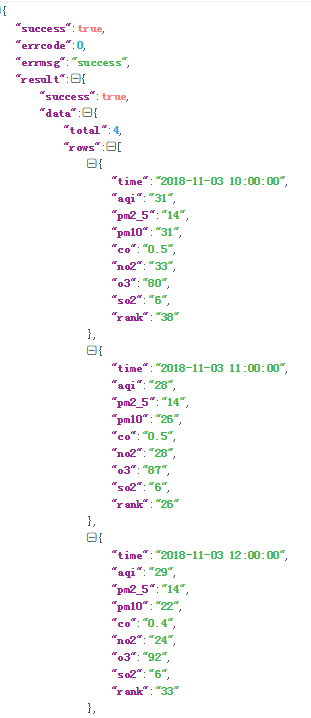
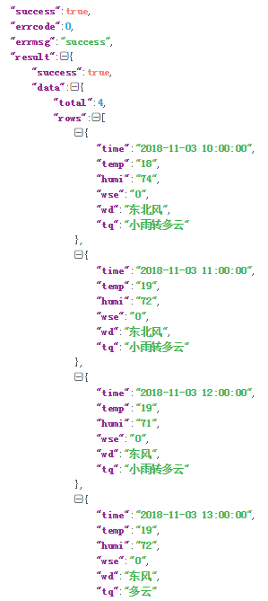
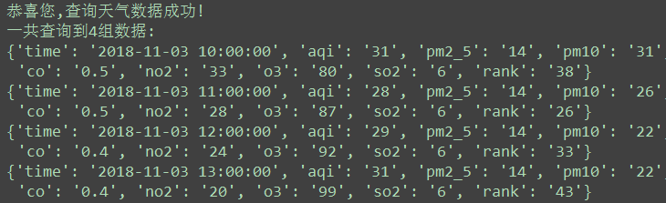
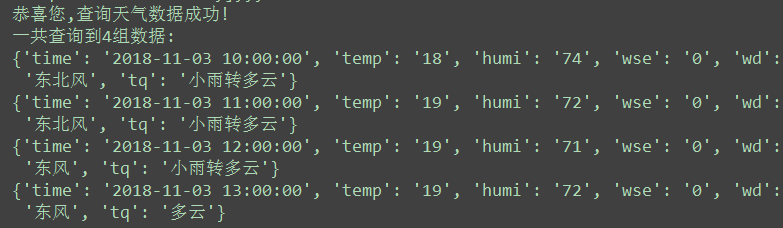
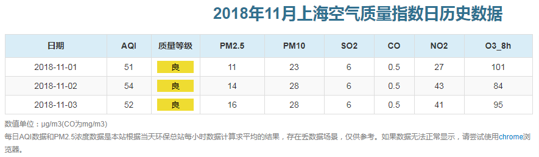
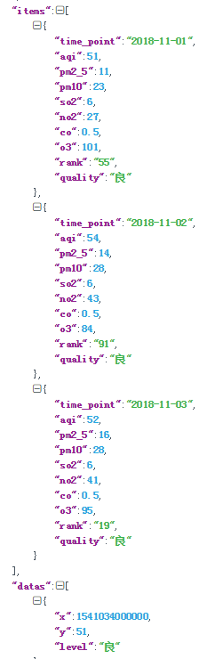
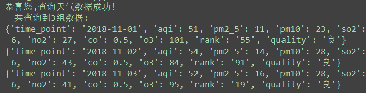

加密破解Aqistudy中国城市空气质量在线检测平台 
===========================
    
### 中国城市空气质量在线检测平台 - https://www.aqistudy.cn/html/city_detail.html
|Author|:sunglasses:Henryhaohao:sunglasses:|
|---|---
|Email|:hearts:1073064953@qq.com:hearts:

      
****
## :dolphin:免责声明
### 软件均仅用于学习交流，请勿用于任何商业用途！感谢大家！  

## :dolphin:介绍
### 该项目为加密破解[Aqistudy中国城市空气质量在线检测平台](https://www.aqistudy.cn/html/city_detail.html)的天气数据
> - **爬虫文件:Spiders目录下的aqistudy_weather.py**
> - **三种查询方式:**
>  1.  **get_aqistudy('GETDETAIL', '上海', 'HOUR', '2018-11-03 10:00:00', '2018-11-03 13:00:00')**
>  2.  **get_aqistudy('GETCITYWEATHER', '上海', 'HOUR', '2018-11-03 10:00:00', '2018-11-03 13:00:00')**
>  3.  **get_history('上海', '201811')**
## :dolphin:数据类型
### 形如：
|index |aqi |city |co |no2 |o3 |pm10 |pm2_5 |quality |rank |so2 |temp|humi|wse|ws|tq|time_point|
|----- |--- |---- |-- |--- |-- |---- |----- |------- |---- |--- |----|----|---|--|--|----------|
|0 |28 |上海 |2.6 |0.4 |17 |89 |16 |优 |128 |6 |18 |78 |1 |东北风 |小雨 |2018-11-06 05:00|
|1 |26 |上海 |1.6 |0.4 |19 |83 |11 |优 |126 |6 |18 |74 |2 |东北风 |小雨 |2018-11-06 06:00|
|2 |25 |上海 |2.0 |0.4 |25 |78 |13 |优 |109 |6 |18 |71 |1 |东北风 |小雨 |2018-11-06 07:00|
|3 |22 |上海 |1.2 |0.4 |34 |70 |20 |优 |70  |6 |18 |70 |1 |东北风 |小雨 |2018-11-06 08:00|
|…… |…… |…… |…… |……|……|…… |…… |…… |……|……|……|……|……|……|……|……|
## :dolphin:运行环境
**Version: Python3**
## :dolphin:安装依赖库
```
pip3 install -r requirements.txt
```
## :dolphin:**相关截图**
> - **查看空气质量数据 - https://www.aqistudy.cn/html/city_detail.html**<br><br>






> - **查看空气质量历史数据 - https://www.aqistudy.cn/historydata/monthdata.php**<br><br>



## :dolphin:**总结**
 **最后，如果你觉得这个项目不错或者对你有帮助，给个Star呗，也算是对我学习路上的一种鼓励！<br>
 哈哈哈，感谢大家！笔芯哟~**:cupid::cupid:


